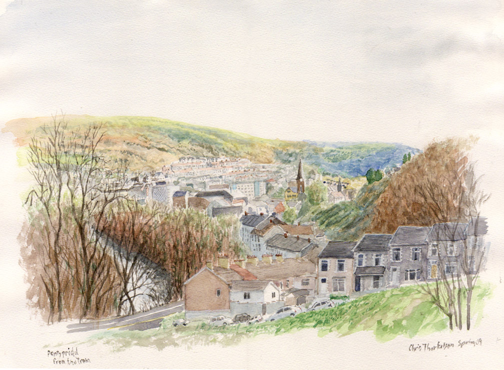

# Precarious Histories

---

# Deindustrialization in Wales

---

Pontypridd, South Wales, 2009

---

## In 1984, British coal miners went on strike...

---

Background:

- Postwar Britain had numerous nationalized industries - like the National Coal Board.
- Margaret Thatcher's government planned to cut funding to the coal board.
- Certain areas (South Wales) were dominated by coal.
- The National Union of Mineworkers, led by Arthur Scargill, was the main organ of organized labor.
- The government deliberately misrepresented its desire for massive cuts.

---

# Davies, "Dark Inner Landscapes: The South Wales Coalfield"

No miner enjoys his working landscape which is inimical to most human experience. It is a polymath of great complexity about which allegorical illusions abound. Here in the coalfields of Wales, vicars fail to terrify miners with tales of Hell since the description is an all too familiar experience for them. In their semi-nakedness such men have extracted coal in cramped, dangerous, claustrophobic landscapes, amidst noise, cloying dust, and foul air for 200 years. (40)

---

Wales is subject to a program of deindustrialization which involves the drastic shedding and the eventual eradication of the traditional pillars of its economy, namely coal and steel.... Consequently, this area from which employment has departed or to which it comes but fitfully and rarely is undergoing a landscape transformation that is leaving mining villages void of identity, forlornly isolated, and awash. (37)

---

So rapid is the ongoing erasure of the mining scene with its two landscape surfaces--the rarely viewed, dark inner landscape of the pit and the more familiar surface features of pit head gear, slag heaps, and grey streaked villages--that soon all visual testimony to an industry that once fueled the Industrial Revolution and gave light and warmth to a nation will be extinguished. (37-38)

---

# "30 Years of Hurt"

---

# "The Death of a Coal Mine"

---

# Ultimately, Brexit (2015)

"Puzzling many analysts, the Leave vote was the strongest in deprived, postindustrial areas that have arguably benefitted the most from EU support."

(https://www.youtube.com/watch?v=UQyP--U_tbA)

---

# Meanwhile in South Africa...

---

## South African constitution, 1996

## Chapter 2: Bill of Rights

---

## Freedom of trade, occupation and profession §22

Every citizen has the right to choose their trade, occupation or profession freely. The practice of a trade, occupation or profession may be regulated by law. 

---

## Labour relations §23

1. Everyone has the right to fair labour practices.
2.  Every worker has the right—
  a. to form and join a trade union;
  b. to participate in the activities and programmes of a trade union; and
  c. to strike.

---

## Can one really say that one has the right to choose one's profession if there are no jobs?

---

## Barchiesi, *Precarious Liberation*

The official discourse of the South African transition praised patience over radical demands, reconciliation over conflict, and personal initiative over reliance on public programs. Work and wage labor test the boundaries of postapartheid citizenship because they are quintessentially liminal categories encompassing, in the everyday lives of black South Africans, material precariousness, memories of past expropriations, potentials for social solidarity, and expectations of a better life under nonracial democracy. (27)

---

# The civic meaning of work

1. What is the relationship between a **citizen** and a **subject**?
2. What is the relationship between labor and politics?

---

# Security and capitalism

The ANC’s historic program, the 1955 Freedom Charter, declared that “there shall be work and security.” (25)

Whereas old imageries of citizenship rights gave rise to expectations the state could hardly manage, the resignification of the citizen into a consumer devolves governmental tasks to the individual’s economic self-discipline. (175)

---

# Deindustrialization in the East Rand

---

Following COSATU’s adoption of the ANC’s program, East Rand workers massively participated in political strikes, but their militant visibility contrasted their deepening economic vulnerability. Employers imposed layoffs, technological change, and work reorganization without consulting the unions, which perceived their control of workplaces slipping away due to increasingly opaque economic forces. The recession of the 1980s was followed by liberalization and restructuring in the 1990s, which confirmed the decline of East Rand manufacturing. (168)

---

# Precarity and unionization

- Precarious labor (flexibilized, outsourced, downsized) is bad for unions
- How can you organize temporary people?
- One response to this is to have contracts governing contract work.

---

### A note on class:

## The precarious are not quite the poor.

---

> The earnings of the near totality of the working poor were too high to qualify for public housing finance and too low for mortgage lending. (171)

---

Much of the inner city has become a loosely regulated zone of trade, barter, money laundering, and counterfeiting amid ageing, dilapidated apartment blocks interspersed with incongruously gentrified pockets of cafes and art galleries. A haphazard semi-legal entrepreneurial texture connects and overlaps with gangsterism, vigilantism, unfettered real estate speculation, undocumented migration, and national and international crime syndicates. It also, however, provides services and protections to a precarious multitude, invisible to official regulatory agencies, unmarked in institutional territorial grids, unable to claim constitutional rights, and redundant on the labor market. (176)

---

The discursive production of a globalized Johannesburg summons, instead, an alternative universe of shiny and efficient postindustrialism. Such a representation surely risks dismissing the living conditions of the majority as abnormal and pathological. It also, however, resignifies precarious employment into two contrasting normative narratives. On one hand, informality denotes an unruly, potentially threatening otherness to be kept at bay with ubiYuitous gated communities, high walls, electrified fences, armed checkpoints, and surveillance cameras. But, on the other hand, informality can indicate a virtuous path to accumulation, which finds solace in clichés from the city’s colonial origins as a rugged frontier promising endless rewards for daring entrepreneurs. (177)

---

No doubt, labor in South Africa was never industrialized in the same pattern as in Britain.

Nevertheless, there are eerie similarities: 

- Deindustrialization entails the decline of organized labor.
- Labor may react by linking with social movements.
- Precarity and unemployment yield stigma.
- Old working classes are left out of new economic narratives.
