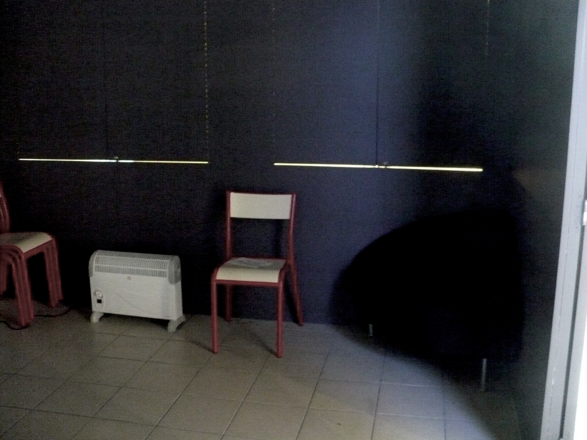

autoscale: true

# Precarious activism

---

## I'm teaching my own work today.

---

## Precarity outside:
## The political unconscious of French academic labor

---

## 1. It's not just about what "precarity" designates, it's about who gets to designate it.

---

## 2. Precarious workers don't like calling themselves that.

---

---

---

## 3. Let's talk about how we analyze precarious discourse.

---

# Excerpts from an anti-precarity event in Paris, 2010.

---

> Moderator: We have all been precarious at one time or another, perhaps not all but many of us. We have picked a few people who represent the different categories [of precarious work] we presented a moment ago, with all their complications. Our precarious colleagues aren’t here to cry over their lot. [ . . . ] Do you want to introduce yourself?

---

> A.L.: Aurélie Legrand, I’m 33 years old, I’m at the master’s level in my studies, with a decade of professional experience in the private sector. It’s been a little more than a year that I’ve been a contract worker at the university, and so I’m part of what they call the precarious workers of higher education. So I work on a term contract [CDD] as a research technician in a social science lab at the university.

---

> I can confess that it was a little bit hard for me to accept this post, even though it represented a good opportunity for me at the time. It was hard to accept because they were offering very short-term contracts. So, I had an interview in December, and they offered me a CDD from the beginning of January 2009 to May 1, 2009, that is a four-month contract, because the permanent occupant of the job, who left on May 1 of the year before, could come back to their post on May 1 the year after. So I had to leave the region where I was coming from because [ . . . ] anyway it was for this four-month contract.

---

> Finally, I accepted this offer, and the permanent occupant didn’t take the job back on May 1 in 2009, so they had me sign a second short-term contract from May 1 to June 30. A two-month contract. It had a gap of two months built in for the summer. So honestly it was a situation that wasn’t comfortable at all. But finally, when they brought me in to sign this second short-term contract, they realized it was a category-A [supervisory] job, so there wouldn’t be a break in the contract.

---

> So they extended the contract to August 31, 2009. And [...] so during that summer, sometime around mid-July, I got a letter from the university’s Human Resources indicating that I was summoned on September 1, in the early morning, to sign a new contract. This time, from September 1 until August 31—so a year-long contract. So I was brought in to sign this new contract, and things more or less worked out for me, because that was the end of the story of these two-month summer interruptions.

---

# Comparison: A more marginal worker

---

Adam: I almost never came when there was the blockade last year, the mobilization.
Eli: You weren’t interested in it?
A: No, it’s not that, but I was busy doing other stuff.
E: You were working, or—
A: Yes, I worked. I was looking for work. Well, I was doing other stuff, I was playing sports, I went out a lot. Well, I went out. I’m not trying to tell you my life story, but yeah, I was doing other stuff. And yeah, I was looking for work, and then I typed up the report for the archival inventory for the exhibit.

---

E: You were getting paid for that?
A: Yeah, I had already gotten paid to do the research, and I hadn’t finished the report yet.
E: And Professor Clement, does she push you to keep going?
A: Of course, it’s thanks to her—
E: But do you want to keep going?
A: Uh, yes. But—

---

E: You want to become a professor?
A: A prof! No, I don’t think so.
E: Not like her?
A: Huh?
E: You don’t want to be the sort of prof in political history that she is?
A: It’s not that I don’t want to, but [laughter], the question, it’s a bit simplistic.

---

E: Fair enough—listen, you’re free to tell me that my questions are dumb! [Laughter.] That doesn’t bother me.
A: It’s not dumb, but, if you like, maybe five years earlier, if I hadn’t dragged on so long, I could maybe tell you, yeah, I want to do a dissertation, try to finish fairly quickly, and then dedicate my life to doing that, try to become a prof. Well, maybe first a high school teacher and eventually a prof in the university. There are plenty of possible routes. But that wasn’t what I wanted, and, um, pfft, well, finally, now it’s not what I want either.

---

# Comparison: A recent Ph.D.

---

Sophie: Bye-bye, Lyon, social history job.
Michèle: So?
S: So the odds are lower. Since three hours ago.
M: Shit . . . do you still have a lot of other interviews to do? Courage, Sophie!
S: It’s worse than that; so far I haven’t gotten a single interview; there are still two or three jobs left where maybe it could work out, but I have to say I’m pretty demoralized . . . we’ll soon find out.

---

M: It’s shit, how they treat researchers and academics and profs in this country!! Kisses, hang in there.
S: Sometimes I have the impression it’s even worse than that, that the academics who are doing the hiring are this system’s watchdogs. They don’t want researchers, don’t want experimenters, but tutors of the already-known (that is, often, of the false). I’m pretty pissed off.

---

> It’s a little strange to reread this conversation now, since at present I’ve made it to the other side of the fence, having gotten a nonprecarious job... But in rereading myself I clearly remember (I believe we have a great capacity for forgetting) the feeling of revolt induced by three straight years of failure (which isn’t even that long). I couldn’t understand why I wasn’t even getting interviews, since people had always told me my work was very good. I had decided that year to completely give up scientific research to do something entirely different (to feed my family as well) if I didn’t succeed in the CNRS competition.

